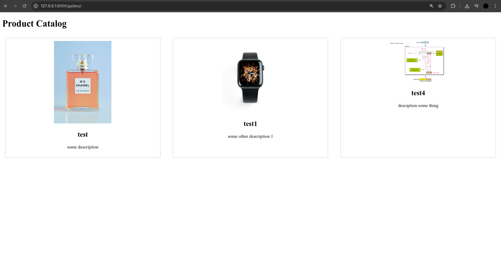
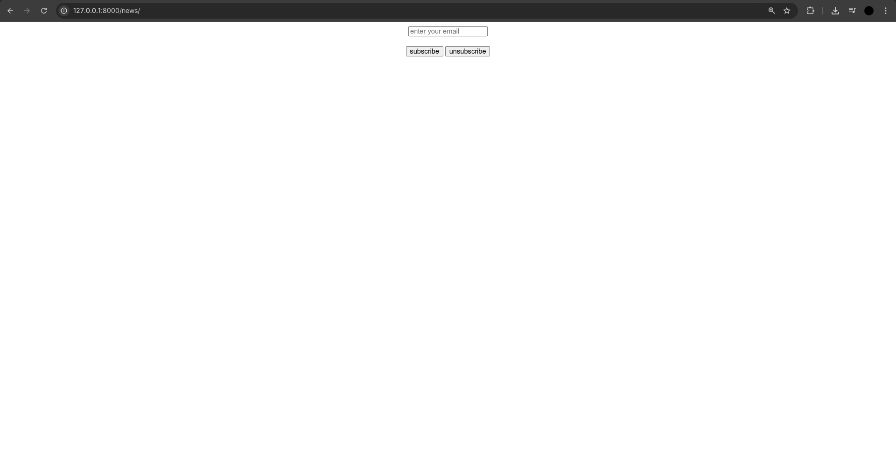
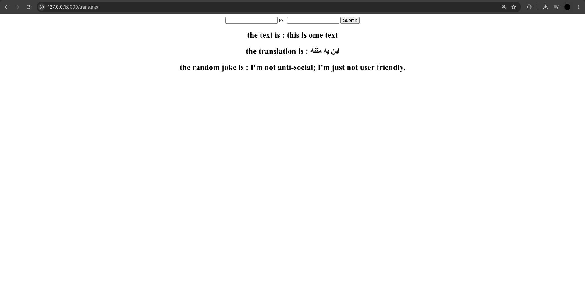
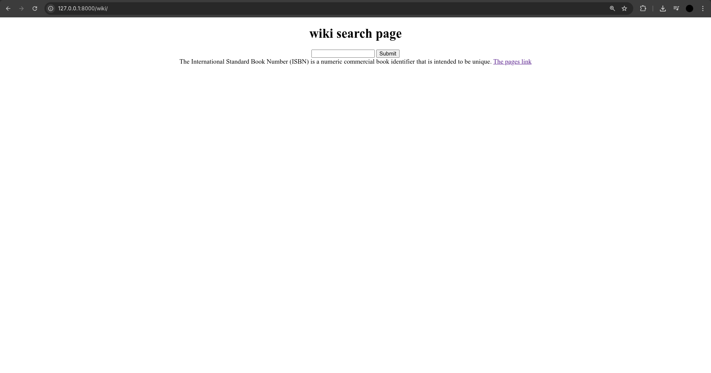
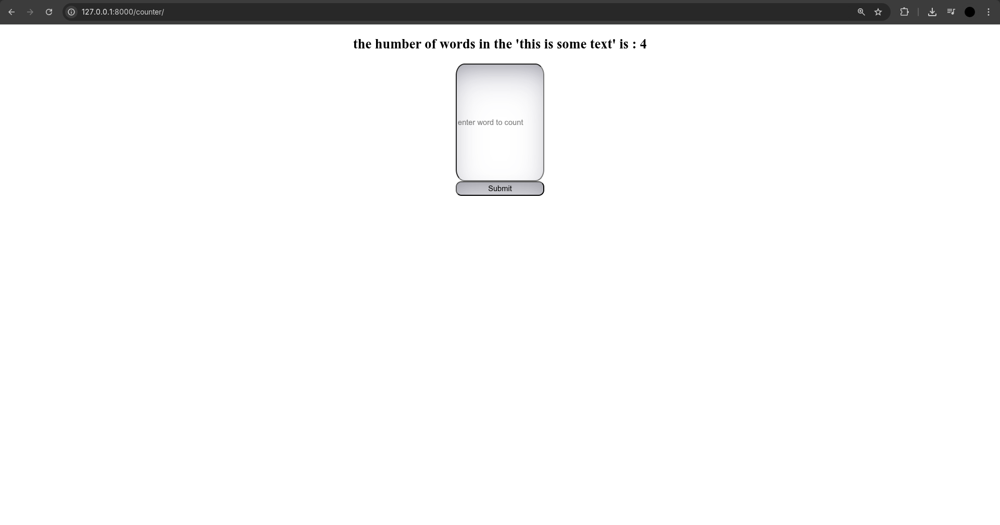

# a beginner level django project
- series of django projects for better undrestanding of the django framework

## Product_gallery

## Features
- adding removing email (interation to db)
- phodo gallery
- sending email throguh django to any email
- translation using some translation api
- searching though wikipedia api and providing the link to that page
- simple word counter


## Installation 
```bash
# Clone the repository
git clone git@github.com:amirsoleimani7/product-gallery.git
cd product-gallery

# Create and activate a virtual environment
python -m venv venv
source venv/bin/activate  # On Windows: venv\Scripts\activate

# Install dependencies
pip install -r requirements.txt

# Run migrations
python manage.py migrate

# Start the development server
python manage.py runserver
```

# gallery


# adding and removing email


# sending email


# translate


# wiki


# word counter



